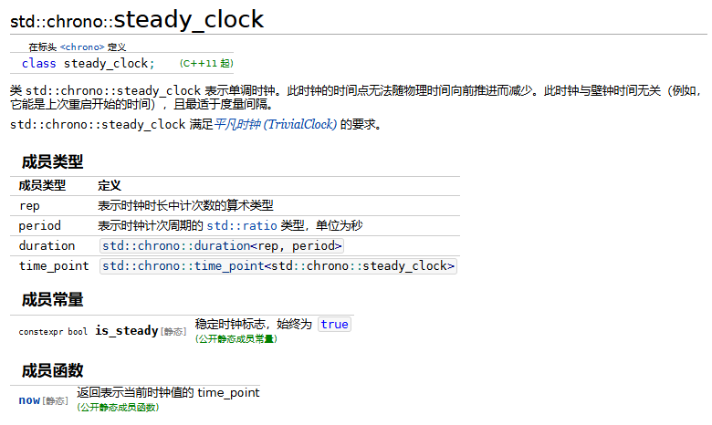

*Date: 2025.1.17*

记录工作开发中踩到的一个c++有关时钟的坑。

# 背景

客户端sdk中要提供一个服务端时间戳的接口，不能受客户端系统修改而调整。实现的基本逻辑：在sdk初始化时向服务端发送一个请求，获取当前的服务端时间戳。此后，在该时间基础上叠加时间偏移量即可。遇到的问题就出现在时间偏移量的获取上。

1. 不受系统时钟的影响。
2. 单调递增。

> 参考来源：[cppreference.com](https://zh.cppreference.com/w/cpp/chrono#.E6.97.A5.E5.8E.86)

c++标准库里的 `<chrono>` 里提供了两个时钟 system_clock & steady_clock。基本概念如下

system_clock：来自系统范畴实时时钟的挂钟时间

steady_clock：决不会调整的单调时钟



文档里描述了“最适于度量间隔”，因此用 steady_clock.now() 来记录获取服务端时间戳的时间点，计算时间偏移量。

功能提交上线后几个月，业务测试同学找过来反馈：应用切后台，手机锁屏一段时间后，获取的时间戳异常。

# 问题原因

手机锁屏较长时间后，会进入深度休眠，steady_clock不会进行计时，也就是说这虽然是单调时钟，但会忽略系统休眠时间间隔。

# 源码分析

一句话很简单，但怎么知道steady_clock忽略系统休眠呢？来看源码。

```cpp
static steady_clock::time_point __libcpp_steady_clock_now() {
  struct timespec tp;
  if (0 != clock_gettime(CLOCK_MONOTONIC, &tp))
    __throw_system_error(errno, "clock_gettime(CLOCK_MONOTONIC) failed");
  return steady_clock::time_point(seconds(tp.tv_sec) + nanoseconds(tp.tv_nsec));
}

steady_clock::time_point steady_clock::now() noexcept { return __libcpp_steady_clock_now(); }
```

实际是用系统c接口的 `clock_gettime`做的封装，第一个入参是枚举值CLOCK_MONOTONIC。`<time.h>` 中定义如下

```cpp
/* Identifier for system-wide realtime clock.  */
# define CLOCK_REALTIME			0
/* Monotonic system-wide clock.  */
# define CLOCK_MONOTONIC		1
/* High-resolution timer from the CPU.  */
# define CLOCK_PROCESS_CPUTIME_ID	2
/* Thread-specific CPU-time clock.  */
# define CLOCK_THREAD_CPUTIME_ID	3
/* Monotonic system-wide clock, not adjusted for frequency scaling.  */
# define CLOCK_MONOTONIC_RAW		4
/* Identifier for system-wide realtime clock, updated only on ticks.  */
# define CLOCK_REALTIME_COARSE		5
/* Monotonic system-wide clock, updated only on ticks.  */
# define CLOCK_MONOTONIC_COARSE		6
/* Monotonic system-wide clock that includes time spent in suspension.  */
# define CLOCK_BOOTTIME			7
/* Like CLOCK_REALTIME but also wakes suspended system.  */
# define CLOCK_REALTIME_ALARM		8
/* Like CLOCK_BOOTTIME but also wakes suspended system.  */
# define CLOCK_BOOTTIME_ALARM		9
/* Like CLOCK_REALTIME but in International Atomic Time.  */
# define CLOCK_TAI			11
```

着重关注CLOCK_REALTIME、CLOCK_MONOTONIC、CLOCK_BOOTTIME的作用及区别。

CLOCK_REALTIME：相对时间，从1970.1.1到目前的时间。更改系统时间会更改获取的值。它以系统时间为坐标。

CLOCK_MONOTONIC：以绝对时间为准，获取的时间为系统重启到现在的时间，更改系统时间对它没有影响。

CLOCK_BOOTTIME：和CLOCK_MONOTONIC类似，也是单调时钟，不过会计算suspension的时间。

至此，明确了手机锁屏长时间后获取时间戳异常的原因了。修复方式：从c++的`steady_clock.now()` 接口换成 `clock_gettime`

但还要注意，CLOCK_BOOTTIME 是linux specific的，能够支持移动端的安卓和鸿蒙。对于iOS平台，应该怎么做呢？

// todo

安卓java实现上有同样的接口，实现也是获得单调时钟时间点，用的api是 。

// todo 源码分析下，确认是包含休眠时间的
